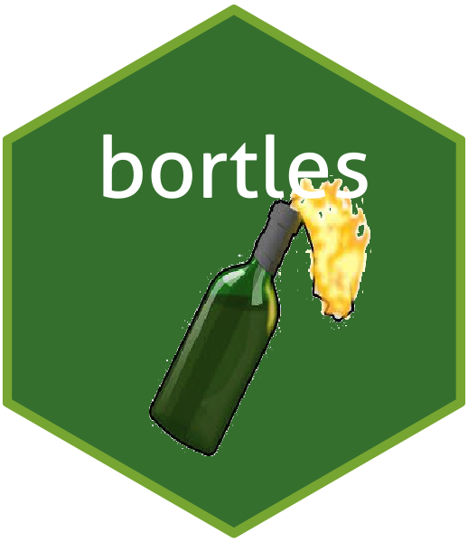

### Display a random forking gif in your RStudio viewer pane

## Installation

You can install the development version of `bortles` from [github](https://www.github.com) with:

``` r
# install.packages("devtools")
devtools::install_github("adam-gruer/bortles")
```

## Example

``` r
library(bortles)

fork()

fork()
```

